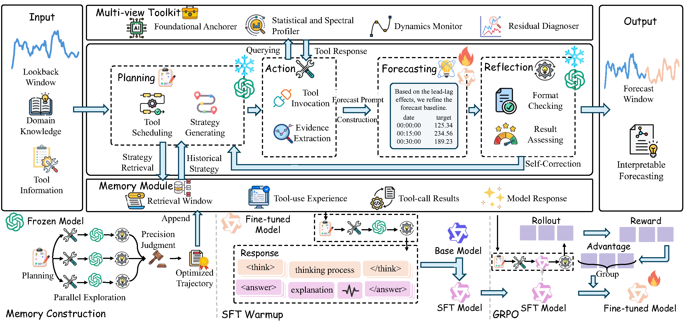

# CastFlow

CastFlow is a role-specialized agentic workflow for time series forecasting. It couples a frozen general-purpose reasoning model for planning and reflection with a trainable local forecasting model for evidence-guided numerical refinement.

The implementation in this directory follows the paper naming and workflow:

- **Planning**: select diagnostic tools using a frozen external LLM.
- **Action**: execute the multi-view toolkit and build an ensemble forecast baseline.
- **Forecasting**: use a fine-tuned local LLM to refine the baseline into a numerical forecast.
- **Reflection**: validate output structure and evidence alignment, then retry if needed.
- **Strategy Memory**: retrieve successful historical tool-use trajectories.
- **Foundational Anchorer**: retrieve similar historical cases and ensemble classical, deep, and foundation time-series models.




## What Is Not Included

This repository intentionally does **not** ship private benchmark datasets or the large local weights used by `scripts/anchorer_runtime`.

You must provide:

- Raw train/test CSV files under `data/raw/train` and `data/raw/test`.
- Local forecasting backbone weights, for example Qwen3-4B, under `models/Qwen3-4B` or another relative path you choose.
- Time-series foundation-model weights required by `scripts/anchorer_runtime`, placed into that runtime tree as described below.

The code expects these paths to exist at runtime; no download is triggered automatically.

## Directory Layout

```text
CastFlow/
  scripts/                          Python package
    anchorer_runtime/               External time-series model runtime; weights are not bundled
    training/                       SFT, RLVR, reward, and export utilities
  data/
    raw/
      train/                        User-provided training CSVs
      test/                         User-provided test CSVs
    sft/                            Exported SFT CSVs
    rl/                             Exported RLVR parquet files
  case_library/                     Generated Foundational Anchorer case libraries
  memory/                           Generated StrategyMemory files
  models/                           SFT/RLVR outputs
  predictions/                      Forecast and evaluation outputs
```

## Dataset Placement

The default registered benchmark suite follows the TPAMI setting: chronological 7:1:2 split, cross-domain joint training, and the following lookback/horizon/stride settings.

| Dataset | Train CSV | Test CSV | Lookback | Horizon | Stride |
| --- | --- | --- | ---: | ---: | ---: |
| BE | `data/raw/train/EPF_BE_train_val.csv` | `data/raw/test/EPF_BE_test.csv` | 168 | 24 | 48 |
| DE | `data/raw/train/EPF_DE_train_val.csv` | `data/raw/test/EPF_DE_test.csv` | 168 | 24 | 48 |
| FR | `data/raw/train/EPF_FR_train_val.csv` | `data/raw/test/EPF_FR_test.csv` | 168 | 24 | 48 |
| NP | `data/raw/train/EPF_NP_train_val.csv` | `data/raw/test/EPF_NP_test.csv` | 168 | 24 | 48 |
| PJM | `data/raw/train/EPF_PJM_train_val.csv` | `data/raw/test/EPF_PJM_test.csv` | 168 | 24 | 48 |
| ETTh1 | `data/raw/train/ETT_ETTh1_train_val.csv` | `data/raw/test/ETT_ETTh1_test.csv` | 96 | 96 | 48 |
| ETTm1 | `data/raw/train/ETT_ETTm1_train_val.csv` | `data/raw/test/ETT_ETTm1_test.csv` | 96 | 96 | 96 |
| WP | `data/raw/train/windy_power_train_val.csv` | `data/raw/test/windy_power_test.csv` | 96 | 96 | 96 |
| SP | `data/raw/train/sunny_power_train_val.csv` | `data/raw/test/sunny_power_test.csv` | 96 | 96 | 96 |
| MOPEX | `data/raw/train/mopex_train_val.csv` | `data/raw/test/mopex_test.csv` | 96 | 96 | 48 |

CSV files should contain one timestamp column named `date` or `time_stamp`. If no timestamp column exists, CastFlow uses the row index. The target column defaults to the last numeric non-timestamp column; use `--target-col` if you need to override it.

## Weight Placement

### Local Forecasting LLM

Place the trainable local model somewhere accessible, for example:

```text
models/Qwen3-4B
```

The TPAMI configuration uses **Qwen3-4B** as the local trainable forecasting backbone. 

### Foundational Anchorer Runtime

`scripts/anchorer_runtime` contains wrappers and local code for the anchorer model pool. Large model weights are not bundled. Put the required weights under the expected runtime subdirectories, for example:

```text
scripts/anchorer_runtime/shared/foundation_models/
scripts/anchorer_runtime/packages/
```

The anchorer can then build per-domain `case_library/*/anchor_library.json` files. If a model weight is missing, the corresponding anchor model may fail or be skipped depending on the runtime wrapper.

## Environment

```bash
cd CastFlow
conda activate <your-env-name>
```

## Requirements

- Python `>=3.10`
- PyTorch `>=2.1`
- `transformers>=4.43`
- `datasets>=2.14`
- `peft>=0.6`
- `pyarrow>=12`
- `agentlightning` for RLVR
- `vllm` for local forecasting serving

The package metadata in `pyproject.toml` already defines the core, training, and RLVR dependency groups.

## Installation

Install the full dependency set from the repository requirements file:

```bash
pip install -r requirements.txt
```

Install the package in editable mode:

```bash
pip install -e ".[training,rlvr]"
```

Install the serving dependency separately if you want local vLLM forecasting:

```bash
pip install vllm
```

Create `.env` in the repository root. The external API is used by Planning and Reflection. The local vLLM server is used only by the Forecasting module during test-time inference.

```env
OPENAI_BASE_URL=http://localhost:8003/v1
OPENAI_API_KEY=test-key
MODEL=forecast

LOCAL_MODEL_BASE_URL=http://localhost:8002/v1
LOCAL_MODEL_NAME=castflow-forecast
LOCAL_MODEL_API_KEY=EMPTY

CASTFLOW_USE_API=true
CASTFLOW_API_TIMEOUT=60
CASTFLOW_PLANNER_MAX_TOKENS=1200
CASTFLOW_FORECASTING_MAX_TOKENS=7000
CASTFLOW_REFLECTION_MAX_TOKENS=800
```

Do not commit real API keys.

## TPAMI Default Parameters

These defaults are now reflected in the CLI and training configs.

| Component | Setting |
| --- | --- |
| Frozen planner/reflection model | Grok 4 or any OpenAI-compatible strong reasoning API |
| Local trainable forecaster | Qwen3-4B |
| Memory construction | K-parallel exploration, `PARALLEL_PLAN_K=4` |
| Memory retrieval | top-k memory retrieval, default `K=3`, threshold `0.90` |
| Reflection retries | train `3`, test `10` |
| SFT | cross-domain, 1 epoch, learning rate `5e-5`, global batch size 8 |
| RLVR | GRPO, group size `G=8`, temperature `1.0`, learning rate `2e-6`, KL coefficient `0.0`, 3 epochs |
| Forecast output length | max completion length 5000 in the paper; runtime default allows up to 7000 tokens for safety |

On 2 A800 GPUs, the paper-level SFT batch can be implemented directly. On 24GB GPUs, use micro-batch 1 with gradient accumulation to keep the effective global batch size at 8.

## End-to-End Workflow

### 1. Build The Foundational Anchorer Case Libraries

This scans all registered train splits and writes one case library per domain.

```bash
python -m scripts build-anchorer
```

Outputs:

```text
case_library/EPF_BE/anchor_library.json
case_library/EPF_DE/anchor_library.json
case_library/EPF_FR/anchor_library.json
case_library/EPF_NP/anchor_library.json
case_library/EPF_PJM/anchor_library.json
case_library/ETT_ETTh1/anchor_library.json
case_library/ETT_ETTm1/anchor_library.json
case_library/windy_power/anchor_library.json
case_library/sunny_power/anchor_library.json
case_library/mopex/anchor_library.json
```

For a fast dry run:

```bash
python -m scripts build-anchorer --max-windows 5
```

### 2. Build Cross-Domain Strategy Memory

`build-memory` automatically loops over all registered train splits and uses the matching `case_library/*/anchor_library.json`.

```bash
python -m scripts build-memory \
  --output memory/cross_domain/memory.json \
  --verbose-samples
```

Output:

```text
memory/cross_domain/memory.json
```

### 3. Export SFT Data From Memory

```bash
python -m scripts export-memory-data \
  --memory memory/cross_domain/memory.json \
  --output data/sft/cross_domain_sft.csv
```

### 4. Supervised Fine-Tuning

Paper-style target: Qwen3-4B, 1 epoch, learning rate `5e-5`, global batch size 8.

```bash
torchrun --nproc_per_node=2 --master_port=32588 -m scripts train-sft \
  --dataset-path data/sft/cross_domain_sft.csv \
  --model-path /path/to/model \
  --output-dir models/sft_cross_domain \
  --batch-size 1 \
  --gradient-accumulation 4 \
  --learning-rate 5e-5 \
  --num-epochs 1
```
Output:

```text
models/sft_cross_domain/
```

### 5. Prepare RL Data

```bash
python -m scripts prepare-rl-data \
  --input data/sft/cross_domain_sft.csv \
  --output data/rl/cross_domain_rl.parquet
```

### 6. RL Training

```bash
python -m scripts train-rlvr \
  --dataset-path data/rl/cross_domain_rl.parquet \
  --model-path models/sft \
  --output-dir models/rl \
  --rollout-n 8 \
  --temperature 1.0 \
  --learning-rate 2e-6 \
  --total-epochs 3 \
  --n-gpus-per-node 2
```

### 7. Serve The Local Forecasting Model

Start vLLM before forecasting. The served model name must match `LOCAL_MODEL_NAME` in `.env`.

```bash
vllm serve path/to/model \
  --host 0.0.0.0 \
  --port 8002 \
  --served-model-name castflow-forecast \
  --api-key EMPTY \
  --dtype bfloat16 \
  --max-model-len 18000 \
  --generation-config vllm
```

### 8. Forecast A Test CSV

Forecasting requires an explicit test CSV via `--data`. For registered benchmark filenames such as `EPF_DE_test.csv` and `windy_power_test.csv`, CastFlow automatically infers the dataset defaults for lookback, horizon, seasonal period, and stride from the file path, so these arguments do not need to be passed manually.

DE example:

```bash
python -m scripts forecast \
  --data data/raw/test/EPF_DE_test.csv \
  --anchor-library case_library/EPF_DE/anchor_library.json \
  --memory memory/cross_domain/memory.json \
  --output predictions/de_forecast.csv
```


### 9. Evaluate Forecasts

DE example:

```bash
python -m scripts evaluate \
  --csv-file predictions/de_forecast.csv \
  --answer-col answer \
  --ground-truth-col ground_truth \
  --output predictions/de_metrics.csv
```

Outputs:

- Console summary with aggregate MSE/MAE.
- Optional row-level metric CSV at `predictions/de_metrics.csv`.

## Single-Domain Development

Cross-domain is the default training path. For debugging a single domain:

```bash
python -m scripts build-memory \
  --dataset DE \
  --anchor-library case_library/EPF_DE/anchor_library.json \
  --output memory/DE/memory.json \
  --max-windows 5 \
  --verbose-samples
```

```bash
python -m scripts export-memory-data \
  --memory memory/DE/memory.json \
  --output data/sft/DE_sft.csv
```

```bash
python -m scripts prepare-rl-data \
  --input data/sft/DE_sft.csv \
  --output data/rl/DE_rl.parquet \
  --dataset-name DE
```


## Citation

If you use CastFlow, cite the corresponding CastFlow paper when it is released.
