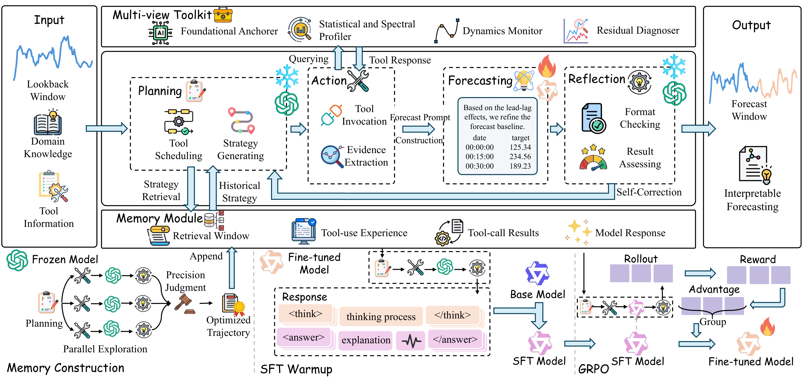

<div align="center">
  
  <h1>CastFlow</h1>
  <p>CastFlow is a role-specialized agentic workflow for time series forecasting. It couples a frozen general-purpose reasoning model for planning and reflection with a trainable local forecasting model for evidence-guided numerical refinement.</p>
  <p><a href="https://forever-pan.github.io/CastFlow/"><kbd><strong>Project page</strong></kbd></a></p>
</div>

<p align="center">
  <a href="https://forever-pan.github.io/CastFlow/">
    
  </a>
</p>

---

## Workflow Overview 🔁

The implementation in this directory follows the paper naming and workflow:

| Component | Workflow |
| --- | --- |
| **Planning** | Select diagnostic tools using a frozen external LLM. |
| **Action** | Execute the multi-view toolkit and build an ensemble forecast baseline. |
| **Forecasting** | Use a fine-tuned local LLM to refine the baseline into a numerical forecast. |
| **Reflection** | Validate output structure and evidence alignment, then retry if needed. |
| **Strategy Memory** | Retrieve successful historical tool-use trajectories. |
| **Foundational Anchorer** | Retrieve similar historical cases and ensemble classical, deep, and foundation time-series models. |

## Directory Layout 🗂️

```text
CastFlow/
  cli/                              CLI entry package (`python -m cli` / `castflow`)
  scripts/                          Bash wrappers for the end-to-end workflow
  utils/                            Runtime config, dataset registry/io, schema, and shared helpers
  evaluation/                       Forecast parsing and metric evaluation
  forecasting/                      Prompting, tool execution, and inference modules
  workflow/                         End-to-end workflow orchestration and strategy memory
  training/                         SFT, RLVR, reward, and export utilities
  anchorer/                         Foundational Anchorer case-library construction
  backends/                         External time-series model runtime
  docs/                             Project page assets
  assets/                           Repository figures
```

## Dataset Placement 📊

The default registered benchmark suite follows the setting: chronological 7:1:2 split, cross-domain joint training, and the following lookback/horizon/stride settings.

| Dataset | Train CSV | Test CSV | Lookback | Horizon | Stride |
| --- | --- | --- | ---: | ---: | ---: |
| BE | `data/raw/train/EPF_BE_train_val.csv` | `data/raw/test/EPF_BE_test.csv` | 168 | 24 | 48 |
| DE | `data/raw/train/EPF_DE_train_val.csv` | `data/raw/test/EPF_DE_test.csv` | 168 | 24 | 48 |
| FR | `data/raw/train/EPF_FR_train_val.csv` | `data/raw/test/EPF_FR_test.csv` | 168 | 24 | 48 |
| NP | `data/raw/train/EPF_NP_train_val.csv` | `data/raw/test/EPF_NP_test.csv` | 168 | 24 | 48 |
| PJM | `data/raw/train/EPF_PJM_train_val.csv` | `data/raw/test/EPF_PJM_test.csv` | 168 | 24 | 48 |
| ETTh1 | `data/raw/train/ETT_ETTh1_train_val.csv` | `data/raw/test/ETT_ETTh1_test.csv` | 96 | 96 | 48 |
| ETTm1 | `data/raw/train/ETT_ETTm1_train_val.csv` | `data/raw/test/ETT_ETTm1_test.csv` | 96 | 96 | 96 |
| WP | `data/raw/train/windy_power_train_val.csv` | `data/raw/test/windy_power_test.csv` | 96 | 96 | 96 |
| SP | `data/raw/train/sunny_power_train_val.csv` | `data/raw/test/sunny_power_test.csv` | 96 | 96 | 96 |
| MOPEX | `data/raw/train/mopex_train_val.csv` | `data/raw/test/mopex_test.csv` | 96 | 96 | 48 |

CSV files should contain one timestamp column named `date` or `time_stamp`. If no timestamp column exists, CastFlow uses the row index. The target column defaults to the last numeric non-timestamp column; use `--target-col` if you need to override it.

## Weight Placement 🧠

### Local Forecasting LLM

Place the trainable local model somewhere accessible, for example:

```text
../models/Qwen3-4B
```

The configuration uses **Qwen3-4B** as the local trainable forecasting backbone.

### Foundational Anchorer Runtime

`backends/` contains wrappers and local code for the anchorer model pool. Put the required weights under the expected runtime subdirectories, for example:

```text
backends/shared/foundation_models/
backends/packages/
```

The anchorer can then build per-domain `case_library/*/anchor_library.json` files. If a model weight is missing, the corresponding anchor model may fail or be skipped depending on the runtime wrapper.

## Environment 💻

```bash
cd CastFlow
conda activate <your-env-name>
```

## Requirements 📦

| Package | Version / use |
| --- | --- |
| Python | `>=3.10` |
| `numpy`, `pandas` | core data handling |
| `openai` | Planning, Reflection, and OpenAI-compatible inference |
| `tqdm` | progress display for long-running workflows |
| `python-dateutil`, `holidays` | time-series calendar utilities |
| `statsmodels`, `pyclustering` | Foundational Anchorer case-library build |
| PyTorch | `>=2.1`, for SFT |
| `transformers` | `>=4.43` |
| `datasets` | `>=2.14` |
| `peft` | `>=0.6` |
| `accelerate`, `deepspeed` | distributed SFT |
| `einops`, `safetensors` | deep learning / model loading |
| `pyarrow` | `>=12`, RL parquet I/O |
| `agentlightning` | RLVR |
| `vllm` | local forecasting serving |
| `chronos-forecasting`, `timesfm` (`<3.12`), `xgboost`, `lightgbm` | anchorer model pool |
| `scipy`, `scikit-learn`, `prophet` | classical / statistical models |

The package metadata in `pyproject.toml` already defines the core, anchorer, training, RLVR, and serving dependency groups.

## Installation ⚙️

Install the full dependency set from the repository requirements file:

```bash
pip install -r requirements.txt
```

Install the package in editable mode:

```bash
pip install -e .
```

Create `.env` in the repository root. The external API is used by Planning and Reflection. The local vLLM server is used only by the Forecasting module during test-time inference.

```env
OPENAI_BASE_URL=http://localhost:8003/v1
OPENAI_API_KEY=test-key
MODEL=forecast

LOCAL_MODEL_BASE_URL=http://localhost:8002/v1
LOCAL_MODEL_NAME=castflow-forecast
LOCAL_MODEL_API_KEY=EMPTY
```

## Default Parameters 🎛️

These defaults are now reflected in the CLI and training configs.

| Component | Setting |
| --- | --- |
| Frozen planner/reflection model | Grok 4 or any OpenAI-compatible strong reasoning API |
| Local trainable forecaster | Qwen3-4B |
| Memory construction | K-parallel exploration, `PARALLEL_PLAN_K=4` |
| Memory retrieval | top-k memory retrieval, default `K=3`, threshold `0.90` |
| Reflection retries | train `3`, test `10` |
| SFT | cross-domain, 1 epoch, learning rate `5e-5`, global batch size 8 |
| RLVR | GRPO, group size `G=8`, temperature `1.0`, learning rate `2e-6`, KL coefficient `0.0`, 3 epochs |
| Forecast output length | max completion length 5000 in the paper; runtime default allows up to 7000 tokens for safety |

## CLI Usage 🖥️

Workflow commands are implemented in `cli/cli.py`. From the repository root:

```bash
python -m cli --help
```

After `pip install -e .`, the same interface is available as `castflow`.

The numbered scripts in `scripts/` wrap these commands with the default cross-domain paths used below. Most scripts forward extra flags via `"$@"`; training and serving scripts also honor environment variables such as `BASE_MODEL_PATH`, `SFT_OUTPUT_DIR`, and `LOCAL_FORECAST_MODEL_PATH`.

## End-to-End Workflow 🚀

Run the steps below from the repository root in order.

<details open>
<summary><strong>1. Build The Foundational Anchorer Case Libraries</strong></summary>

Scans all registered train splits and writes one case library per domain.

```bash
bash scripts/01_build_anchorer.sh
```

Outputs:

```text
case_library/EPF_BE/anchor_library.json
case_library/EPF_DE/anchor_library.json
case_library/EPF_FR/anchor_library.json
case_library/EPF_NP/anchor_library.json
case_library/EPF_PJM/anchor_library.json
case_library/ETT_ETTh1/anchor_library.json
case_library/ETT_ETTm1/anchor_library.json
case_library/windy_power/anchor_library.json
case_library/sunny_power/anchor_library.json
case_library/mopex/anchor_library.json
```

For a quick dry run, append `--max-windows 5`.

</details>

<details open>
<summary><strong>2. Build Cross-Domain Strategy Memory</strong></summary>

Loops over all registered train splits and uses the matching `case_library/*/anchor_library.json`.

```bash
bash scripts/02_build_memory.sh
```

Output: `memory/cross_domain/memory.json`

</details>

<details open>
<summary><strong>3. Export SFT Data From Memory</strong></summary>

```bash
bash scripts/03_export_sft.sh
```

Output: `data/sft/cross_domain_sft.csv`

</details>

<details open>
<summary><strong>4. Supervised Fine-Tuning</strong></summary>

Paper-style target: Qwen3-4B, 1 epoch, learning rate `5e-5`, global batch size 8.

```bash
bash scripts/04_train_sft.sh
```

Defaults: base model `../models/Qwen3-4B`, output `models/sft_cross_domain`, `max-length 14000`. Override with `BASE_MODEL_PATH`, `SFT_OUTPUT_DIR`, `NPROC_PER_NODE`, or `MASTER_PORT`.

</details>

<details open>
<summary><strong>5. Prepare RL Data</strong></summary>

```bash
bash scripts/05_prepare_rl.sh
```

Output: `data/rl/cross_domain_rl.parquet`

</details>

<details open>
<summary><strong>6. RL Training</strong></summary>

```bash
bash scripts/06_train_rlvr.sh
```

Output: `models/rl_cross_domain/`

</details>

<details open>
<summary><strong>7. Serve The Local Forecasting Model</strong></summary>

Start vLLM before forecasting. The served model name must match `LOCAL_MODEL_NAME` in `.env`.

```bash
bash scripts/07_serve_local_forecaster.sh
```

By default this serves `models/sft_cross_domain` on port `8002`. Set `LOCAL_FORECAST_MODEL_PATH` to use an RL checkpoint instead.

</details>

<details open>
<summary><strong>8. Forecast A Test CSV</strong></summary>

Forecasting requires an explicit test CSV via `--data`. For registered benchmark filenames such as `EPF_DE_test.csv` and `windy_power_test.csv`, CastFlow automatically infers lookback, horizon, seasonal period, and stride from the file path.

DE example:

```bash
bash scripts/08_forecast_de.sh
```

Output: `predictions/de_forecast.csv`

</details>

<details open>
<summary><strong>9. Evaluate Forecasts</strong></summary>

DE example:

```bash
bash scripts/09_evaluate_de.sh
```

Prints aggregate MSE/MAE and writes `predictions/de_metrics.csv`.

</details>

## Citation 📖

If you find CastFlow useful in your research, please cite the paper and link to this repository. The manuscript has been submitted to IEEE Transactions on Pattern Analysis and Machine Intelligence; before the official publication metadata is available, please use the provisional BibTeX entry below. After publication, the journal, volume, issue, pages, and DOI fields can be updated accordingly.

```bibtex
@misc{pan2026castflow,
  title        = {CastFlow: Learning Role-Specialized Agentic Workflows for Time Series Forecasting},
  author       = {Pan, Bokai and Cheng, Mingyue and Liu, Zhiding and Yu, Shuo and Tao, Xiaoyu and Wu, Yuchong and Liu, Qi and Lian, Defu and Chen, Enhong},
  year         = {2026},
  note         = {Manuscript submitted to IEEE Transactions on Pattern Analysis and Machine Intelligence},
  url          = {https://github.com/Forever-Pan/CastFlow}
}
```
